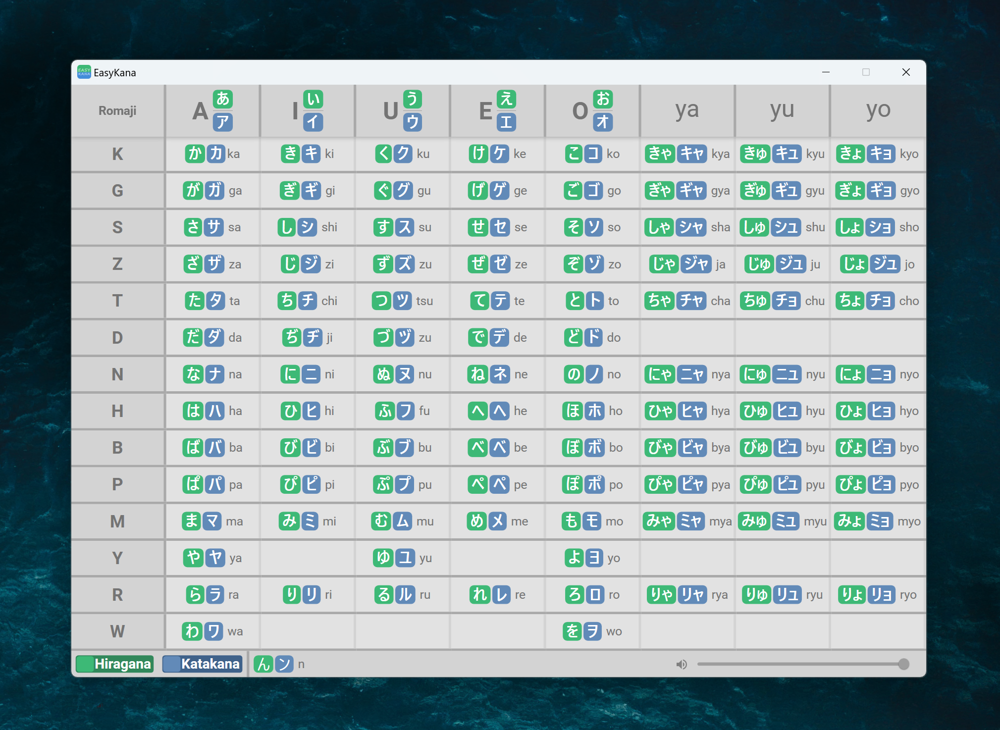

# EasyKana

A kana table built using WPF&[MaterialDesignInXamlToolkit](https://github.com/MaterialDesignInXAML/MaterialDesignInXamlToolkit). By clicking on any kana to hear its pronunciation, helping Japanese beginners better memorize the kana.
Thanks to the [predio01](https://www.reddit.com/r/LearnJapanese/comments/awzw04/kana_table_for_beginners/) for the UI design idea.

# Usage

1. Go to the [Releases](https://github.com/tywhisky/easy-kana/releases) page on GitHub.
2. Download the latest release version (.zip or .exe file).
3. Extract the .zip file (if applicable) and run the .exe file to start the application.

# Contributing
Contributions are welcome! Please post a issue or submit a pull request directly.
